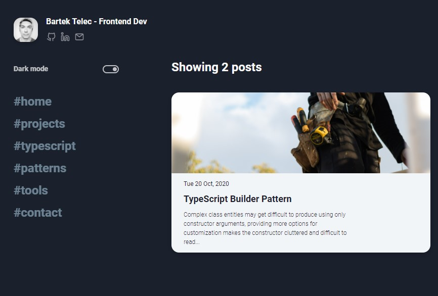

https://next-blog-sable.vercel.app/

# Next Blog

personal blog

## [LIVE DEMO](https://next-blog-sable.vercel.app/)

## Features

- Own design [[FIGMA]](https://www.figma.com/file/lNDlB8dr67C31Ber12PCMy/personal-blog?node-id=0%3A1)
- NextJS
- Git submodule for posts
- Markdown to static generated sites.

## Credits

- [ TailwindCSS](https://tailwindcss.com/)
- [ NextJS](https://nextjs.org/)
- [ React](https://reactjs.org/)
- [Eva-Icons](https://akveo.github.io/eva-icons/#/)
