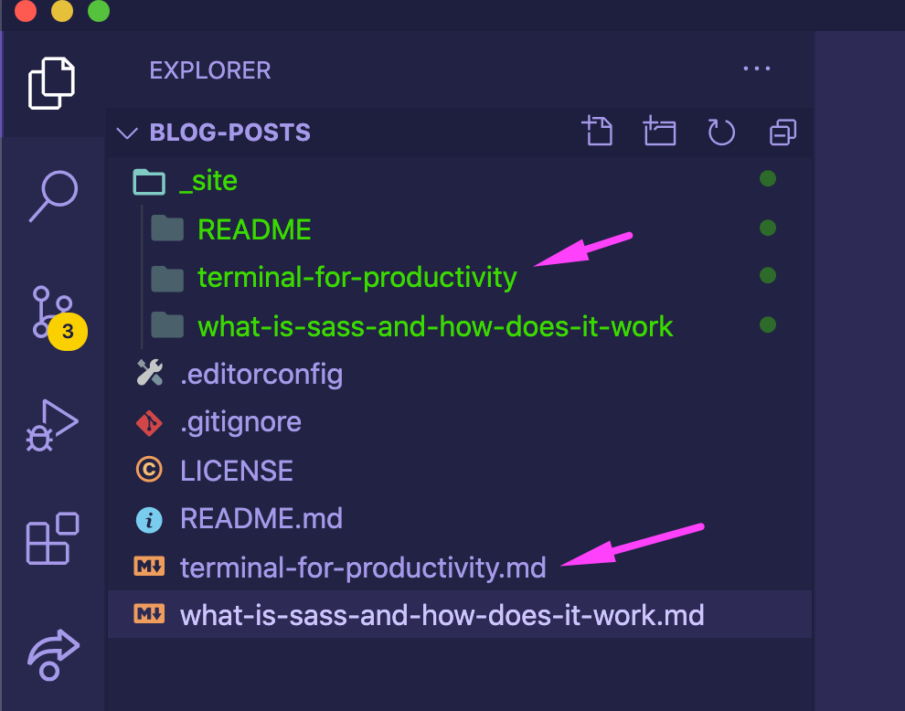

# A statically generated blog example using Next.js and Markdown

This example showcases Next.js's [Static Generation](https://nextjs.org/docs/basic-features/pages) feature using Markdown files as the data source.

The blog posts are stored in `/_posts` as Markdown files with front matter support. Adding a new Markdown file in there will create a new blog post.

To create the blog posts we use [`remark`](https://github.com/remarkjs/remark) and [`remark-html`](https://github.com/remarkjs/remark-html) to convert the Markdown files into an HTML string, and then send it down as a prop to the page. The metadata of every post is handled by [`gray-matter`](https://github.com/jonschlinkert/gray-matter) and also sent in props to the page.

## Demo

[https://next-blog-starter.now.sh/](https://next-blog-starter.now.sh/)

## Deploy your own

Deploy the example using [Vercel](https://vercel.com?utm_source=github&utm_medium=readme&utm_campaign=next-example):

[](https://vercel.com/import/git?c=1&s=https://github.com/vercel/next.js/tree/canary/examples/blog-starter)

### Related examples

- [WordPress](/examples/cms-wordpress)
- [DatoCMS](/examples/cms-datocms)
- [Sanity](/examples/cms-sanity)
- [TakeShape](/examples/cms-takeshape)
- [Prismic](/examples/cms-prismic)
- [Contentful](/examples/cms-contentful)
- [Strapi](/examples/cms-strapi)
- [Agility CMS](/examples/cms-agilitycms)
- [Cosmic](/examples/cms-cosmic)
- [ButterCMS](/examples/cms-buttercms)
- [Storyblok](/examples/cms-storyblok)
- [GraphCMS](/examples/cms-graphcms)
- [Kontent](/examples/cms-kontent)

## How to use

Execute [`create-next-app`](https://github.com/vercel/next.js/tree/canary/packages/create-next-app) with [npm](https://docs.npmjs.com/cli/init) or [Yarn](https://yarnpkg.com/lang/en/docs/cli/create/) to bootstrap the example:

```bash
npx create-next-app --example blog-starter blog-starter-app
# or
yarn create next-app --example blog-starter blog-starter-app
```

Your blog should be up and running on [http://localhost:3000](http://localhost:3000)! If it doesn't work, post on [GitHub discussions](https://github.com/vercel/next.js/discussions).

Deploy it to the cloud with [Vercel](https://vercel.com/import?filter=next.js&utm_source=github&utm_medium=readme&utm_campaign=next-example) ([Documentation](https://nextjs.org/docs/deployment)).

# Notes

This blog-starter uses [Tailwind CSS](https://tailwindcss.com). To control the generated stylesheet's filesize, this example uses Tailwind CSS' v1.4 [`purge` option](https://tailwindcss.com/docs/controlling-file-size/#removing-unused-css) to remove unused CSS.

# JavaScript 2 Hackathon

> As a developer it is important to have side projects.

Note:
This hackathon is tied to your Design systems MA 3 delivery.

- it's a good way to implement the technologies you are interested in
- it shows the world you are capable developer and are actively developing code
- it shows you have willingness to learn new things
- it helps you learn

For this hackathon you are to build a Personal website with a blog section.

It is time for you start writing about what you have learned about. Do not wait for one day to come. Start now. e.g write blog post about what an Array is and how you access an index of an array. This will help you communicate and improve your understanding of JS, CSS and HTML and design.

This project will be long living, and it is to be updated during the rest of your front end course.

## Requirements

- choose a static site generator to build from
- https://www.11ty.dev/ for vanilla js
  - use es modules, everything we learned in JS 2.
- https://nextjs.org/ for React
- https://nuxtjs.org/ for VueJS
- or choose from list: [https://scotch.io/tutorials/top-10-static-site-generators-in-2020](https://scotch.io/tutorials/top-10-static-site-generators-in-2020)
- you will need to update the website design using your design system made in Design 2. (\*MA 3)
- if you do not have a design system, use your own imagination.

Must have (in order of requirement):

- a blog article page
- a homepage (Must have, keep it simple, can show list of blogs in grid or something.)
- a blog list page (list of blog posts you will write),
- about page (connect to Github API and show list of your repositories, nice to have)
- portfolio section (Nice to have, links and screenshots to your projects, leave for last)
- contact page (Nice to have, leave for last)

> This project will be long living you do not have to complete it all in one day.

### CSS Frameworks

> if you choose to use a framework you MUST OVERRIDE the styles with your DESIGN SYSTEM styles.

- use a CSS Framework ([Foundation](https://get.foundation/), [Bulma](https://bulma.io/), [Bootstrap](https://getbootstrap.com/), [UIkit](https://getuikit.com/), [Semantic UI](https://semantic-ui.com/), [Pure CSS](https://purecss.io/), [Milligram](https://milligram.io/))
- you are free to choose between Sass, CSS Modules, Styled Components, (or what ever your CSS Framework dictates)

### Level 1

- Design systems must be implemented on the UI.
- At least one blog post page visible:
  - you should be able to generate HTML pages or views from your markdown files in your blog e.g. https://github.com/mannuelf/blog-posts
  - 
  - the static site generator will take care of it for you.

### Level 2

- Design systems 2
  - Create a dark mode theme.
